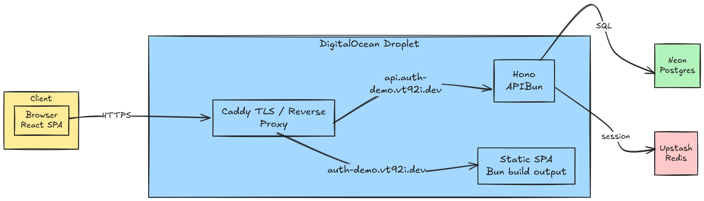

# auth-demo

## 🖼 Screenshots

<table>
  <tr>
    <td align="center">
      <br/>
      <em>Desktop — Login</em>
    </td>
    <td align="center">
      <br/>
      <em>Desktop — Register</em>
    </td>
  </tr>
  <tr>
    <td align="center">
      <br/>
      <em>Desktop — Dashboard</em>
    </td>
    <td align="center">
      <br/>
      <em>Mobile — Login</em>
    </td>
  </tr>
  <tr>
    <td align="center">
      <br/>
      <em>Mobile — Register</em>
    </td>
    <td align="center">
      <br/>
      <em>Mobile — Dashboard</em>
    </td>
  </tr>
</table>

---

## 🚀 Tech Stack

| Layer | Tech |
|-------|------|
| Runtime | **Bun** |
| Backend | **Hono**, **Neon (Postgres)**, **Upstash (Redis)** |
| Frontend | **React**, **React Router v7 (SPA)**, **shadcn/ui** |
| Deployment | **DigitalOcean Droplet** + **Caddy** |

---

## 📦 Getting Started

```bash
git clone https://github.com/vt92i/auth-demo.git
cd auth-demo
bun install

cp apps/api/.env.example apps/api/.env
cp apps/web/.env.example apps/web/.env

bun run dev
```

## 🏗️ Architecture

<br/>

